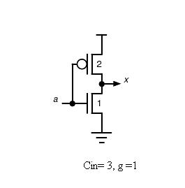
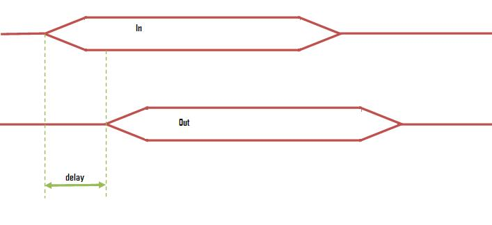

Common challenges that chip designers face is that how large should be the transistors and how many stages of logic can give least delay. In other words how to optimize gate size to minimize the delay of a logic path.

The method of logical effort is one of the methods used to estimate delay in a CMOS circuit. The model describes delay caused by the capacitive load that the logic gate drives and by the topology of the logic gate. As the gate increases delay also increases, but delay depends on the logic function of the gate also.

**Delay in a Logic Circuit**

Gate delay can be estimated from following formula.

**D= p + h**

Where, p is an intrinsic delay
h is an effort delay

Effort delay is a product of logical effort and electrical effort.

**h= g x f**

where, g is logical effort which is a ratio of gate input’s capacitance to the inverter capacitance when sized to deliver the same current and f is an electrical effort (f= Cout/Cin) which is a function of load/gate size. Logical effort of an inverter is 1 which is shown below.

In this experiment, it will be learnt how a delay can be reduced by changing the gate size of an inverter. The following figure shows what actually is meant by delay here

In theory we will be proceeding further with reducing the shown delay, i.e., reducing the time between giving an input and getting the output.
