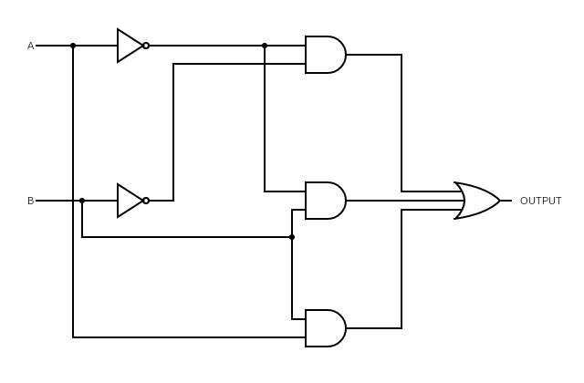

 

- Study the provided circuit consisting of logic gates, including AND, OR, and NOT gates, along with inputs and outputs.

- Analyze the circuit and determine the propagation delay for each gate in the circuit. Assume that each gate has a fixed propagation delay and has an intrinscic propagation delay of 6 units and logical effort of 3 units, 3 units, 1 unit for AND, OR, NOT gates respectively. Assume electrical effort to be f, f', f'' for AND, OR, NOT gates respectively.

- Calculate the total propagation delay of the circuit by considering the delays of each individual gate and the overall signal path.

- Identify critical paths within the circuit. These are the paths that contribute the most to the overall propagation delay.

- Propose logical optimizations to reduce the propagation delay of the circuit. You can modify the circuit by adding or removing gates, rearranging the gates, or using different gate configurations to achieve the desired results. Explain your reasoning behind each optimization.

- Apply the logical optimizations to the circuit and redraw the modified circuit.

- Recalculate the propagation delay of the optimized circuit. Compare it with the original circuit and analyze the improvements achieved through the optimizations.

- Discuss the trade-offs involved in optimizing gate delays and the limitations of your approach. Consider factors such as circuit complexity, gate availability, and logical constraints.

- Reflect on the importance of gate delays in real-world applications and provide examples where gate delay optimization plays a crucial role.