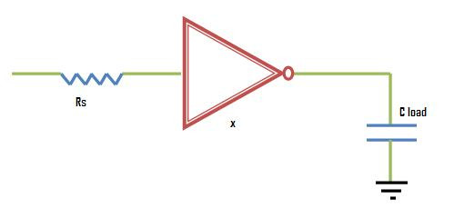
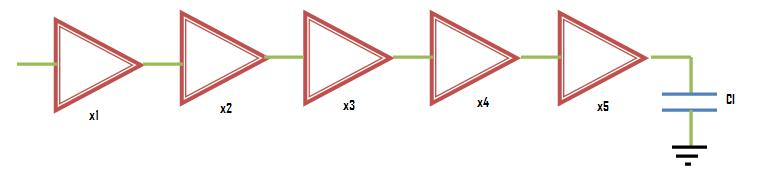
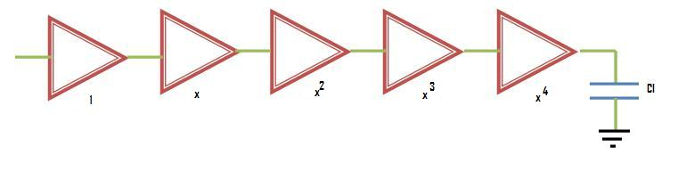
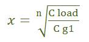

In this experiment, our goal is to calculate the propagation delay when some load is driven by a chain of inverters. To start with, let us consider simple case of a single inverter driving a capacitative load CL as shown in the following figure

Now we want to optimize size of the inverter, x, when driven by a source resistance Rs and driving a load of CL .

To drive CL fastly, we can make inverter size very large but then Rs will become very slow while driving such large size inverter as its input capacitance will be very large on increasing size by large amount.

If we reduce the size of an inverter and make it very small such that Rs drive it very quickly, then the delay to drive load capacitance will increase. So there is an optimal point in between these two conditions and we will see that optimal point further in this section

One thing that should be remebered is the effect of scaling of size of an inverter on its resistance and capacitance value. Suppose the size of an inverter has been scaled by a factor x, then its resistance will get reduced by the same factor while its capacitance will be increased by the same factor.

For getting optimum size of inverter, we differentiate the delay with respect to size. And when we put that value of size in the expressions of delay at the input of an inverter and delay in output, we get the same expressions. So we can summarize the optimal result for the above figure as below:

**An inverter is scaled for optimium delay when the RC product of its input capacitance and the external resistance driving it, equals the RC product of its output resistance and the external load that it drives.**

Now we will extend this concept for a chain of inverters as shown below

As we have seen earlier that to minimize delay, the RC product at input and output of an inverter should be same. Similar is the case with chain of inverters. Therefor the optimum size of each inverter is the geometric mean of its neighbors - meaning that if each inverter is sized up by the same factor x with respect to the preceding inverter, it will have the same effective RC product and hence the same delay.

The following figure shows the relationship in sizes of a chain of five inverters

Now we just have to see what is the value of x. The value of x derived by differentiating delay expression is nth root of CL/Cg1 where

n is equal to the number of inverters in the chain
CL is equal to the load capacitance
Cg1 is equal to the input gate capacitance of the first inverter

So expression for x is shown below

