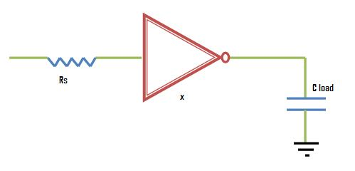
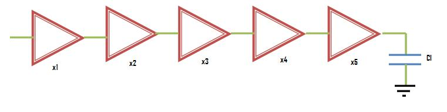
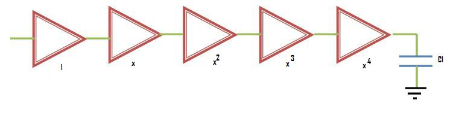
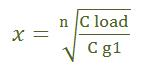
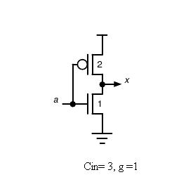
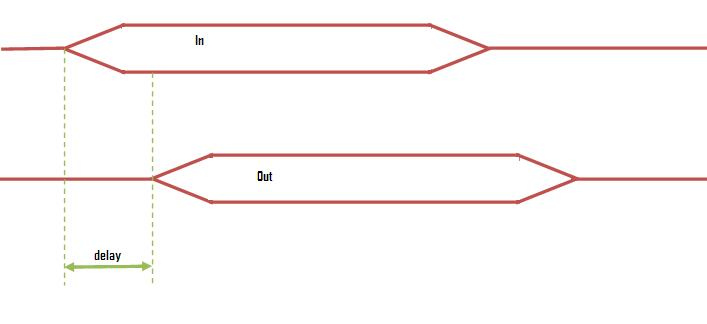

In this experiment, the goal is to calculate the propagation delay when a load is driven by a chain of inverters. We begin with a simple case: a single inverter driving a capacitive load $C_L$.

---

### Sizing a Single Inverter

When optimizing the size of an inverter ($x$), driven by a source resistance $R_s$ and driving a load $C_L$:

- **Large inverter size:** Drives $C_L$ quickly, but $R_s$ struggles due to increased input capacitance.
- **Small inverter size:** $R_s$ drives quickly, but delay to $C_L$ increases.

There is an optimal point between these extremes.

**Effect of Scaling:**

- If inverter size is scaled by $x$:
  - Resistance decreases by $x$
  - Capacitance increases by $x$

**Optimal Condition:**

> An inverter is scaled for optimum delay when the RC product of its input capacitance and the external resistance driving it equals the RC product of its output resistance and the external load that it drives.

---

### Chain of Inverters

Extending the concept to a chain of inverters:

To minimize delay, the RC product at input and output of each inverter should be the same. The optimum size of each inverter is the geometric mean of its neighbors. If each inverter is sized up by the same factor $x$ with respect to the preceding inverter, it will have the same effective RC product and hence the same delay.

**Example: Chain of Five Inverters**

---

### Optimum Sizing Factor

The value of $x$ (scaling factor) is:

$$
x = \sqrt[n]{\frac{C_L}{C_{g1}}}
$$

Where:

- $n$ = number of inverters in the chain
- $C_L$ = load capacitance
- $C_{g1}$ = input gate capacitance of the first inverter

---

### Delay in Logic Circuits and Logical Effort

One of the common challenges in chip design is determining the optimal transistor size and number of logic stages to minimize delay. The method of logical effort is used to estimate delay in CMOS circuits, accounting for capacitive load and gate topology.

**Gate delay formula:**

$$
D = p + h
$$

Where:

- $p$ = intrinsic delay
- $h$ = effort delay

**Effort delay:**

$$
h = g \times f
$$

Where:

- $g$ = logical effort (ratio of gate input capacitance to inverter capacitance when sized for equal current)
- $f$ = electrical effort ($f = C_{out}/C_{in}$), a function of load/gate size

**Logical effort of an inverter is 1:**

---

### Delay Illustration

In this experiment, you will learn how delay can be reduced by changing the gate size of an inverter.

The goal is to reduce the time between input and output transitions by optimizing gate sizing in a chain of inverters.

---

### Summary Table: Delay Parameters

| Parameter | Description                              |
| --------- | ---------------------------------------- |
| $R_s$     | Source resistance                        |
| $C_L$     | Load capacitance                         |
| $C_{g1}$  | Input gate capacitance of first inverter |
| $x$       | Sizing factor for each inverter          |
| $n$       | Number of inverters in the chain         |
| $g$       | Logical effort                           |
| $f$       | Electrical effort                        |
| $p$       | Intrinsic delay                          |
| $h$       | Effort delay                             |
| $D$       | Total delay                              |
